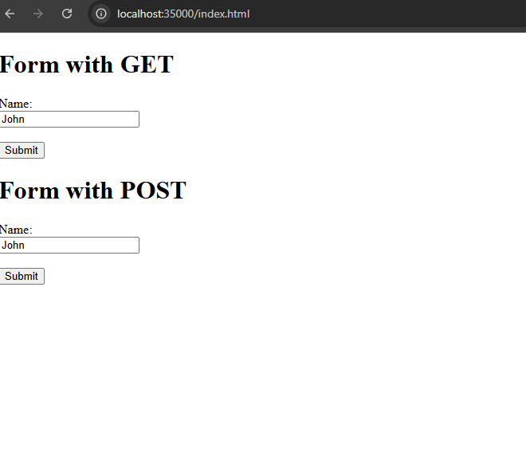
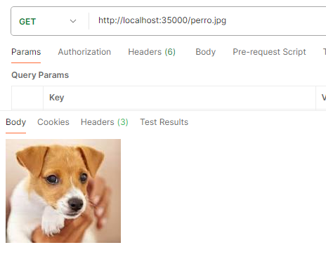
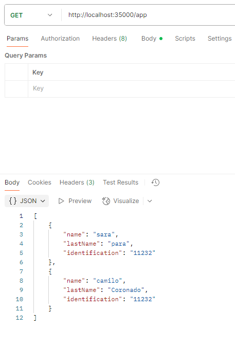
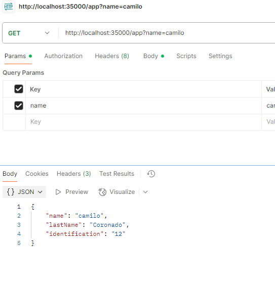
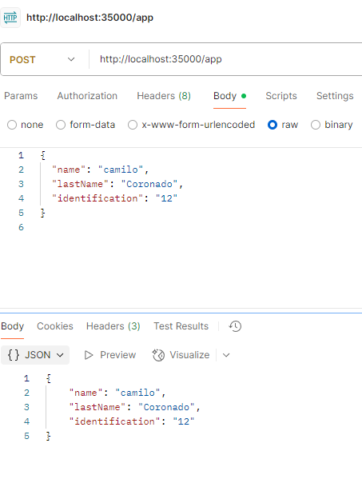
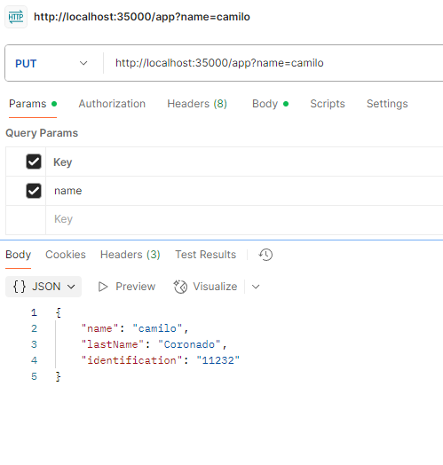
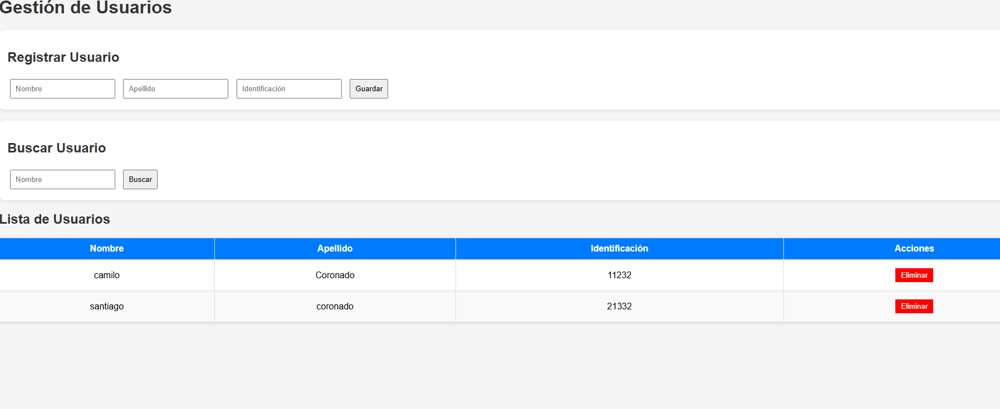

# Concurrent HTTP Server

A simple multithreaded HTTP server built in Java.  
It handles client connections concurrently and serves **static files** like HTML, CSS, JS, and images from a local `public/` directory.  
Additionally, it exposes **REST endpoints** under `/app` and includes an asynchronous client that demonstrates a CRUD for `User`.

---

## Getting Started

These instructions will get you a copy of the project up and running on your local machine for development and testing purposes.  
See deployment for notes on how to deploy the project on a live system.

---

### Prerequisites

You need to have the following installed:

- Java 8+ (JDK)
- Maven

---

### Installing

Clone the repository:

```bash
git clone https://github.com/yourusername/concurrent-http-server.git
cd concurrent-http-server
```


## Build the project using Maven:

```bash
mvn clean install
```

Ensure you have your static files in the correct folder:

src/main/resources/public

Start the server :

```bash
java -cp target/your-jar-name.jar com.edu.escuelaing.arep.serverConcurrent.HttpServer
```

# Accessing the Web Server

Open your browser and navigate to:

```bash
http://localhost:35000/
```

You should see your `index.html` rendered.



also your images



We see that the server is receiving requests.


## At this point, I decided to integrate a user CRUD to show the rest of the functionalities.

## REST API (/app)

Besides serving static files, the server also exposes a REST API under the path `/app`.  
This REST service was used to implement a CRUD for **User**.

### Example Endpoints

- **GET** `/app/users` → Returns all users
- 

    
- **GET** `/app?name=` → Returns user name 
- 
    
- **POST** `/app/users` → Creates a new user
- 
    
- **PUT** `/app?name=` → Updates an existing user
- 
    
- **DELETE** `/app?name=` → Deletes a user
- 
    


## Asynchronous Client

An asynchronous client was developed to interact with the REST API.  
It demonstrates how to consume the server’s REST endpoints to perform CRUD operations on users.



