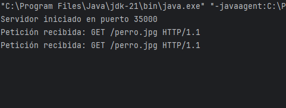

# Concurrent HTTP Server

A simple multithreaded HTTP server built in Java. It handles client connections concurrently and serves static files like HTML, CSS, JS, and images from a local `public/` directory.

## Getting Started

These instructions will get you a copy of the project up and running on your local machine for development and testing purposes. See deployment for notes on how to deploy the project on a live system.

### Prerequisites

You need to have the following installed:

Java 8+ (JDK)
Maven


### Installing

Follow these steps to get the development environment running:

Clone the repository:

git clone https://github.com/yourusername/concurrent-http-server.git

cd concurrent-http-server


## Build the project using Maven:

```bash
mvn clean install
```

Ensure you have your static files in the correct folder:

src/main/resources/public/index.html

Start the server :

```bash
java -cp target/your-jar-name.jar com.edu.escuelaing.arep.serverConcurrent.HttpServer
```

Open your browser and navigate to:

```bash
http://localhost:35000/
```

You should see your `index.html` rendered.





## Running the tests

Currently, the server is simple and does not have automated tests included. You can test it manually by accessing different routes and files in your browser or via tools like `curl` or `Postman`.

